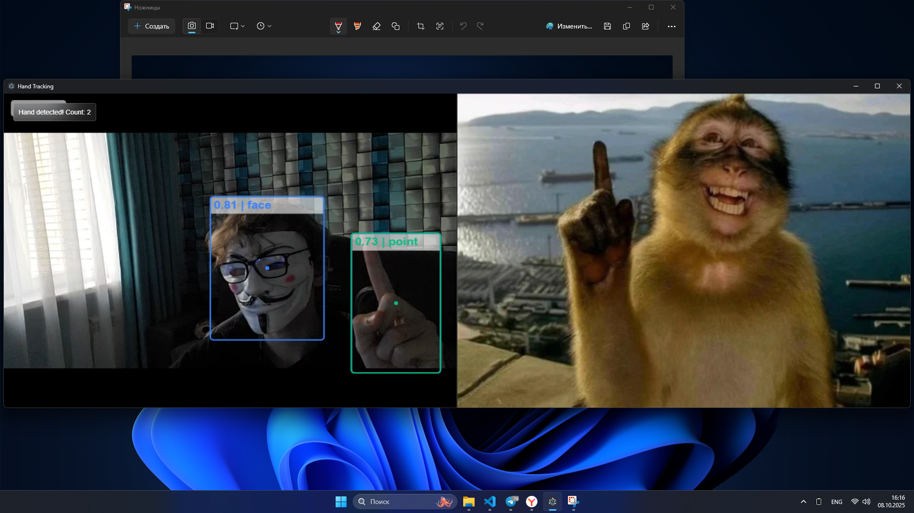

# Monkey Detector

Electron application that displays a pointing monkey when you point your finger. Uses real-time hand tracking to detect index finger gestures and show corresponding monkey images.



## Features

- Real-time hand gesture detection
- Live camera feed with hand tracking
- Dynamic image switching based on finger position
- Cross-platform desktop application

## Usage

1. Run the application
2. Allow camera access
3. Point your index finger at the camera
4. The monkey image will appear mimicking your gesture

## Installation

```bash
npm install
npm start
```

## Technologies

- Electron
- HandTrack.js
- Computer Vision
